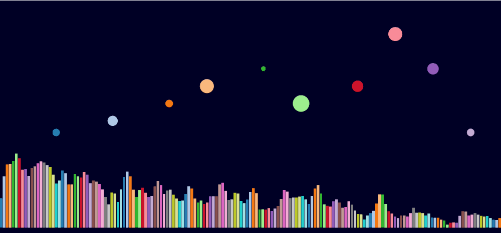

d3-react
========

simple d3 react circles + music bar chart w/ audio api



# Run Locally

```bash
python -m SimpleHTTPServer <port>
```

or using [serve](https://www.npmjs.com/package/serve)

```bash
serve
```